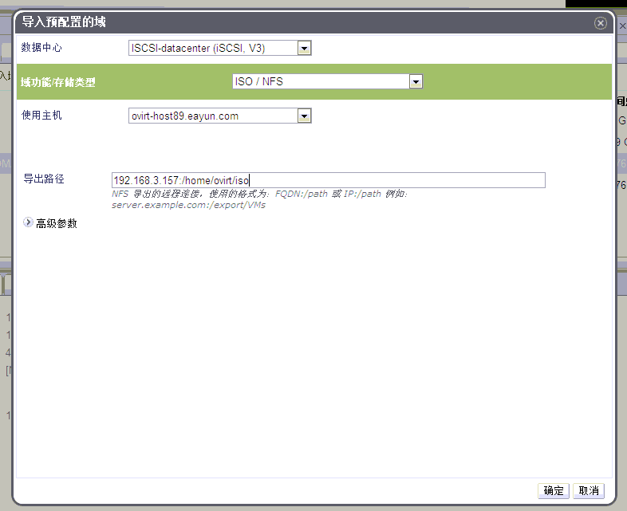

# 导入存在的 ISO 域或导出域

*概述*.
如果已经有一个存在的已在其它数据中心中使用的 ISO
域或者导出域，现在想把它添加到数据中心中，导入虚拟机或者使用其中的 ISO
镜像。

点击*存储*标签，列出目前存在的所有存储域。

点击*导入域*按钮，打开*导入预配置的域*窗口，如图：

在*数据中心*下拉框选择一个想到导入到的数据中心。

从*域功能/存储域类型*下拉菜单中选择 ISO/NFS、ISO/POSIX Complaint FS 或者
Export/NFS。

在*使用主机*下拉菜单，选择适当的主机。

> **Important**
>
> 与存储域的通信都通过所选择的*使用主机*而不是通过 OVIRT
> MANAGER本身。所以至少数据中心中必须有一台活动主机才能够配置存储。

填写*导出路径*，如 192.168.3.157:/home/ovirt/iso。

点击*确定*导入存储域，并关闭窗口。

存储域被导入到数据中心中并在*存储*标签下显示。下一步是将其附加到数据中心中，将在本章后面的内容说明。

*结果*.
成功地导入了已存在的导出域或者 ISO 域。将其附加到数据中心中以使用它。
