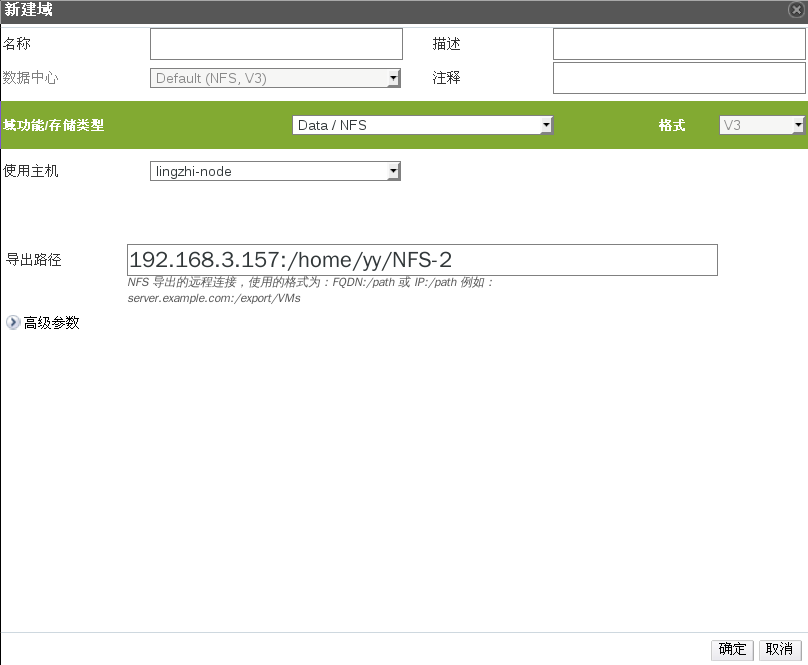

# 添加 NFS 存储

*概述*.
NFS存储域可以用来存放虚拟机镜像文件、ISO 文件或者用来作为导出域。

在 OVIRT 管理界面中打开*存储*标签列出已存在的存储域。

点击*新建域*按钮打开*新建域*窗口。

输入存储域的*名称*（比如 test-nfs）。

从下拉菜单中选择*数据中心*、*域功能/存储类型*和*使用主机*。

如果可用，使用下拉菜单选择适当的*格式*。

最后，在*导出路径*中填写 NFS 服务器的完整路径，比如
192.168.176.157:/exports/iso，然后点击确定，一段时间之后，你会看见我们新建的存储域已经在存储列表里面了

> **Important**
>
> 与存储域的通信都通过所选择的*使用主机*而不是通过 OVIRT
> MANAGER本身。所以至少数据中心中必须有一台活动主机才能够配置存储。

*结果*.
新建的 NFS 存储域将会出现在*存储*标签下，其状态显示为
*Locked*。操作完成之后它将会被自动附加至数据中心。
