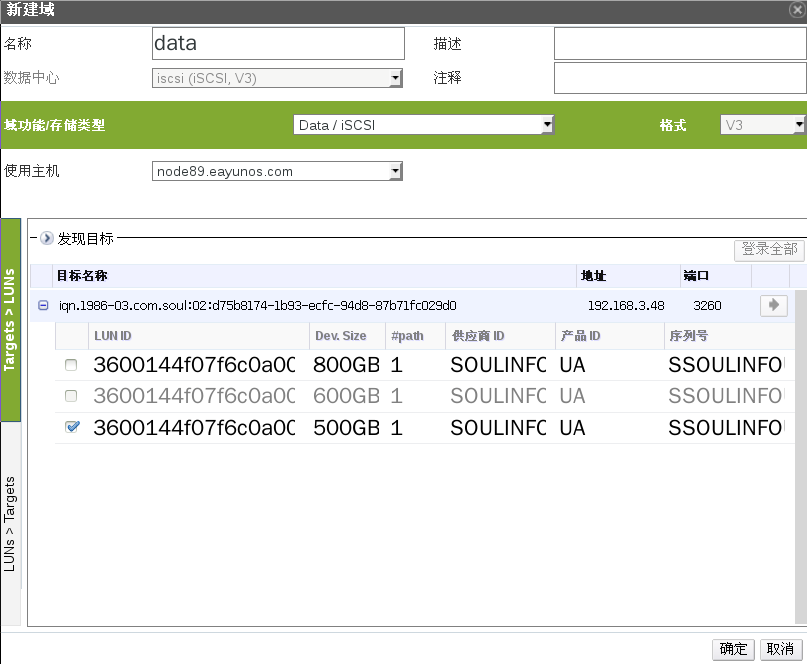
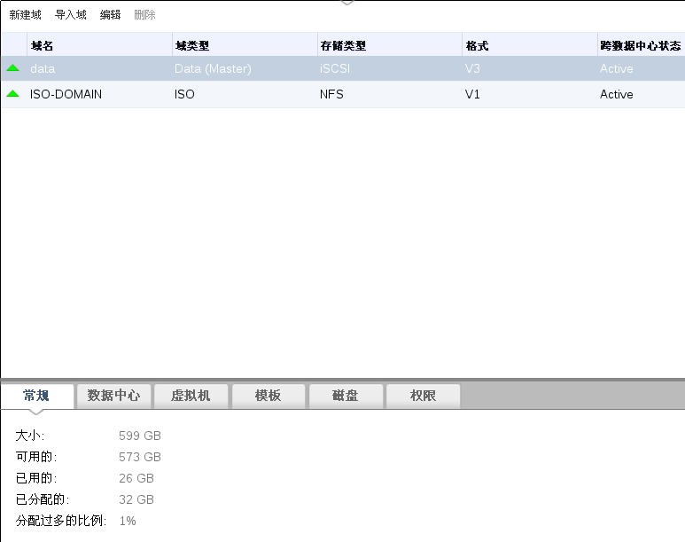

# 添加 iSCSI 存储

*概述*.
OVIRT 平台通过从已存在的 LUN 组成的逻辑卷组创建存储域来支持 iSCSI
存储。同一时间，逻辑卷组和 LUN 都只能附加到一个数据域中。

注意，只能添加 iSCSI 存储域到类型为 iSCSI 的数据中心。

点击*存储*标签，列出目前存在的所有存储域。

点击*新建域*按钮打开*新建域*窗口，如图：

输入存储域的*名称*。

在*数据中心*下拉框选择一个 iSCSI
类型的数据中心，如果暂时没有该类型的数据中心，先选择 *(none)*。

从*域功能/存储域类型*下拉菜单中选择 *Data/iSCSI*。

在*使用主机*下拉菜单，选择适当的主机。

> **Important**
>
> 与存储域的通信都通过所选择的*使用主机*而不是通过 OVIRT
> MANAGER本身。所以至少数据中心中必须有一台活动主机才能够配置存储。

OVIRT 虚拟化管理平台目前支持自动发现和登录 iSCSI LUNS，只要你设置好了
iSCSI 的服务器地址等信息，其它的事情管理平台会自动帮你完成：

1.  点击*发现目标*，如果 iSCSI target 已经登录了，那么会自动把没有用的
    LUN 显示出来。

2.  输入 iSCSI 服务器的*地址*。

3.  *端口*通常为 3260，一般不需要进行更改。

4.  如果启用了 CHAP 用户验证，勾选*用户验证*，并填写 CHAP 用户名和密码。

5.  点击*发现*按钮。

6.  在下面的 target 列表中，选择要登录的
    target，点击*登录*按钮，或者点击*登录全部*。

在 target 列表中，点击 + 按钮，展开所有该目标没有使用的 LUN。

在显示的 LUN 列表中，选择将用以创建存储域的 LUN。

点击*确定*，创建 iSCSI 存储域，并关闭窗口。

几分钟之后，就可以看到创建好的 iSCSI 存储域名了，如图所示：

