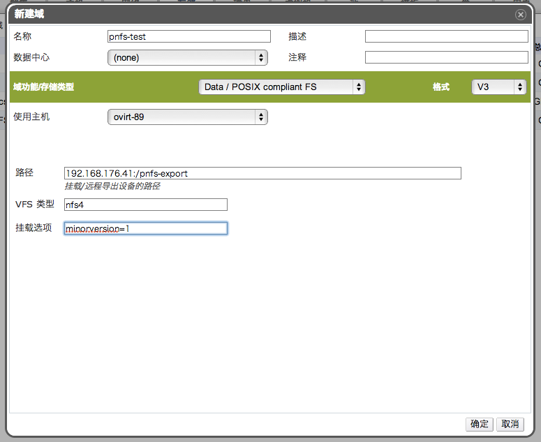

# 添加 pNFS 存储

pNFS 存储域是通过兼容 POSIX 的方式来添加的，它可以为 OVIRT
提供虚拟机镜像文件，ISO 镜像等服务。

点击*存储*标签列出系统中的存储域。

点击*新建域*打开*新建域*窗口，如图：

输入存储域的名称，描述和注释（这两项可选）。

在下拉菜单中选择适当的*数据中心*、*域功能/存储域类型*和*使用主机*。

输入 pNFS 的*导出路径*。如: 192.168.176.41:/pnfs-export

在 *VFS 类型*中输入 *nfs4*。

在 *挂载选项*中填写 *minorversion=1*

点击确定保存设置，添加该存储到 OVIRT 系统中。

*结果*.
新建的 pNFS 存储域将会出现在*存储*标签下，其状态显示为
*Locked*。操作完成之后它将会被自动附加至数据中心。

