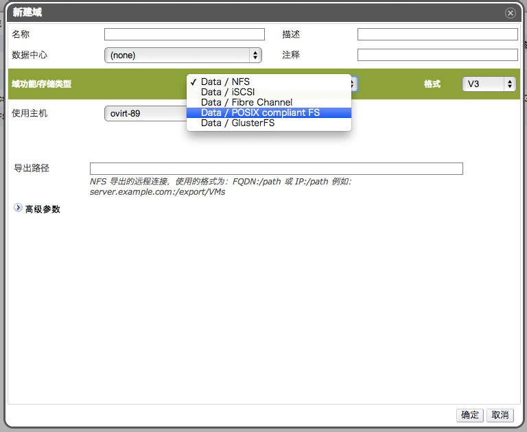

# 添加兼容 POSIX 的存储域

*概述*.
用户希望使用兼容 POSIX 的文件系统作为存储域。

点击*存储*标签列出已存在的存储域。

点击*新建域*打开*新建域*窗口，如图：

输入存储域的名称，描述和注释（这两项可选）。

在*数据中心*的下拉框里，选择关联的数据中心。注意该数据中心必须得是 POSIX
类型的，如果 POSIX 类型的数据中心不存在，可以暂时选择 *(none)*。

从*域功能/存储域类型*下拉菜单中选择 *Data/POSIX complaint FS*。

在*使用主机*下拉菜单选择适当的主机。

填写 POSIX 文件系统的*路径*，和 mount 参数的路径是一致的。

填写 *VFS 类型*，和 mount 的 *-t* 参数是一致的。

填写*挂载选项*，和 mount 的 *-o* 参数是一致的。

点击确定保存设置，添加该存储到 OVIRT 系统中。

*结果*.
成功挂载了一个 POSIX 兼容的文件系统作为存储域。
