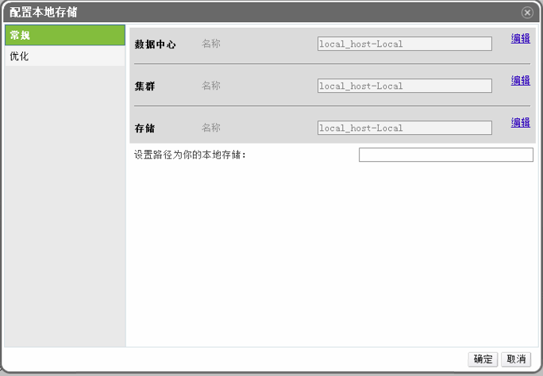

# 添加本地存储

*概述*.
在一个主机上添加本地存储域，同时配置了一个新的数据中心，新的集群，并把该主机加入到该集群上。

点击*主机*标签选择需要配置本地存储的主机。

点击*维护*把主机设置为维护模式。

点击*配置本地存储*打开*配置本地存储*窗口。

分别点击*数据中心*、*集群*和*存储*旁边的*编辑*按钮配置他们的名称。

在文本框中填入本地存储的路径。

点击确定保存设置并关闭该窗口。

*结果*.
主机将在它自己的新的数据中心中上线。

