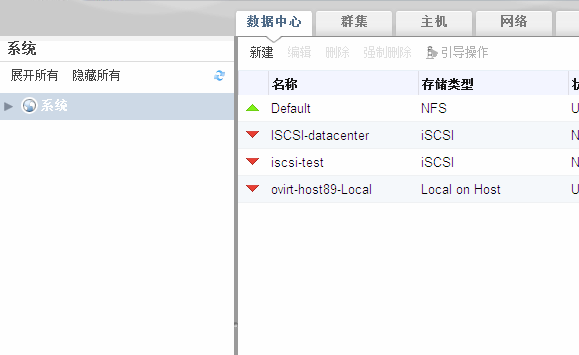

### 树形结构和平面视图

EayunOS 管理系统提供了两种模式: 树形模式和扁平模式。树形模式把一个数据
中心的所有资源按照继承的方式显示出来，从最顶层的数据中心到最底层的虚拟机。
推荐用树形模式来管理 EayunOS 系统。

⁠

**树形模式**

扁平模式可以让用户在数据中心，存储域中搜索。前面谈到，在树形模式中,
所有的资源是按照从上到下继承的关系，但是在扁平模式中，没有限定这种
限定关系，用户可以在扁平模式中搜索 EayunOS 系统中的所有资源。比如,
你可以在虚拟机标签上搜索所有 CPU 使用率超过 80% 的虚拟机，搜索的结果
属于整个系统，而不是某个特定的虚拟机。此外，在树形模式中某些没有显示的
资源在扁平模式中是可以显示的，比如**池**和**用户**。

想要访问扁平模式，点击在左边**树形**面板上的
**系统**，就进入了扁平模式了，此时可以看到 **池**和**用户**标签。

⁠

**扁平模式**
