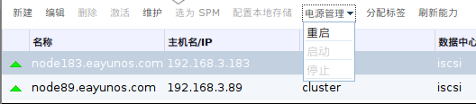

# 使用主机电源管理功能

*前提：*

-   ?

*概述*.
主机上的电源管理配置完成之后，您可以在管理员门户界面上使用一系列的操作选项。虽然每个电源管理设备都有其自定义的选项，但它们都支持最基本的选项包括启动、停止和重启主机。

使用*主机*标签、树形面板或者搜索功能来搜索并在主面板中选择主机。

点击*电源管理*下拉菜单。

从以下几个选项中选择：

-   *重启*：该选项将关闭主机并等待主机的状态切换为
    *Down*。当代理确认主机已关闭时，高可用的虚拟机将会在集群中的另一台主机上重启。然后代理将重新启动该台主机。当主机的状态为
    *Up* 时意味着它能够被正常使用。

-   *启动*：该选项启动一台主机并让其加入一个集群。当它能够被正常使用时状态将显示为
    *Up*。

-   *停止*：该选项将关闭主机。使用这个选项之前，请确认在这台主机上运行的虚拟机已被迁移至集群中的其它虚拟机。否则虚拟机将会异常中止，并且只有高可用的虚拟机会在另外一台主机上重启。当主机被关闭时，它的状态将会是
    *Non-Operational*。

    > **Important**
    >
    > 当主机上设置了两个隔离代理时，它们能够被并行使用或者依次使用。如果是并行的，两个代理都必须响应停止命令主机才能够被关闭；但主机启动只需要其中一个代理响应启动命令即可。如果是依次使用的代理，启动或者停止主机时，主要的代理将会被首先使用，当其失败时，才会使用次要的代理。

选择以上选项中的一个打开确认窗口。点击确定进行确认并继续。

*结果*.
所选择的操作被执行。
