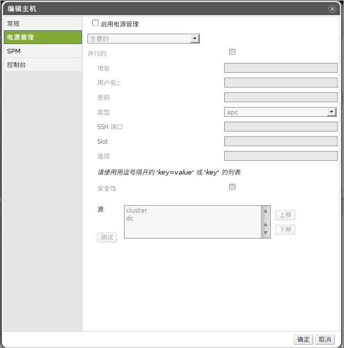

# 在主机上设置隔离的参数

主机隔离的参数使用*新建主机*或者*编辑主机*窗口中的*电源管理*标签下的项目来进行设置。电源管理允许系统通过使用例如远程接入卡(RAC)之类的额外接口隔离一台出问题的机器。

所有电源管理相关的操作是通过一台代理的主机完成的，而不是由 OVIRT
MANAGER本身完成。因此要完成电源管理相关的操作，至少需要两台主机。

使用*主机*标签、树形面板或者搜索功能查找并在主面板中选择主机。

点击*编辑*按钮打开*编辑主机*窗口。

点击*电源管理*子标签。

勾选*启用电源管理*激活窗口中的选项。

当您需要配置一个新的电源管理设备时，*主要的*选项默认将被选中。如果您需要添加一个新设备，将该项设置为*次要的*。

勾选*并行的*选项将允许多个隔离代理同时进行工作。

输入电源管理设备的*地址*、*用户名*和*密码*。

从下拉菜单中选择电源管理设备*类型*。

输入用于电源管理设备与主机进行通信的*端口*。

输入该电源管理设备特有的*选项*。使用逗号分隔的“key=value”或者“key”项目的列表。

点击*测试*按钮测试该电源管理设备。如果测试成功，将会显示“Test Succeeded,
on”。

> **Warning**
>
> 电源管理的参数（用户名、密码、选项等）只在设置和您手动要求时 OVIRT
> MANAGER才会进行测试。如果您选择忽略不正确参数的警告，或者电源管理硬件上的参数被更改而
> OVIRT MANAGER上没有做相应的更改，隔离操作将很有可能在最需要的失效。

点击*确定*保存所做的修改并关闭该窗口。

*结果*.
您将返回到主机列表的界面。您将注意到主机名前面的感叹号已经消失了，这标志着电源管理已被成功配置。

*参见：*

-   ?
