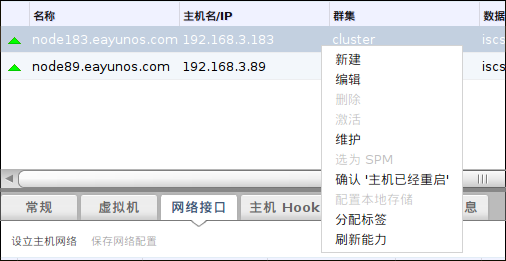

# 手动隔离或孤立无响应的主机

*概述*.
如果一台主机突然的变为无响应的状态，例如由于硬件错误；这能够明显影响整个环境的正常表现。如果您的主机上没有电源管理设备，或者该电源管理设备被不正确地配置，您可以手动重启主机。

> **Warning**
>
> 除非您重启了主机，否则不要使用*确认主机已经重启*选项。在主机仍在正常运行的情况下使用这个选项可能引起虚拟机镜像异常。

在*主机*标签，选择该主机。主机的状态必须显示为 *Non-Responsive*

手动重启该主机。这意味着您可以要进入实验室并重启该主机。

在管理员门户中，右键点击该主机并选择*确认主机已经重启*按钮。

系统弹出一个对话框提示您确认主机已被关闭或者重启。勾选*确认操作*并点击*确定*。

*结果*.
您成功手动重启了主机，高可用的虚拟机会在其它活动主机上启动。您在管理员门户中确认了您手动进行了隔离，然后主机将重新回到在线状态。

