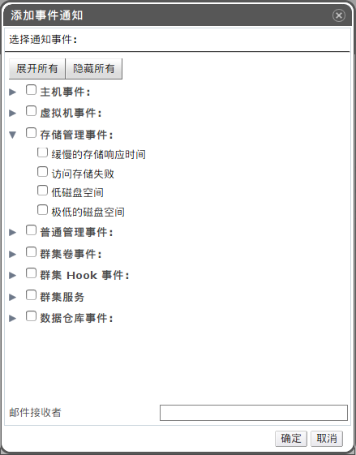

# 配置事件通知

*概述*.
如果您希望 OVIRT
环境中的某个事件发生的时候能够收到一封通知邮件，您需要配置邮件转发代理以发送信息。

确保您使用正确的参数配置了邮件转发代理。

使用*用户*资源标签、树形面板或者搜索功能以查找并选择用户。

在详情面板中点击*事件通知器*以列出用户将被通知的事件。在用户未进行事件通知配置的时候，该列表将会为空。

点击*管理事件*按钮打开*添加事件通知*窗口。

使用*展开所有*按钮，或者每个分类的展开按钮，来查看可供选择的事件。

勾选合适的选择框。

在*邮件接收者*一栏输入电子邮箱地址。

点击*确定*保存更改并关闭该窗口。

在 OVIRT MANAGER所在的服务器上添加并启动 *ovirt-engine-notifier*
服务。这将激活您刚才所做的更改。

    # chkconfig --add ovirt-engine-notifier
    # chkconfig ovirt-engine-notifier on
    # service ovirt-engine-notifier restart

*结果*.
您现在将收到关于您的 OVIRT
环境中发生的事件的邮件通知。选择的事件将会在用户的*事件通知器*子标签下显示。

