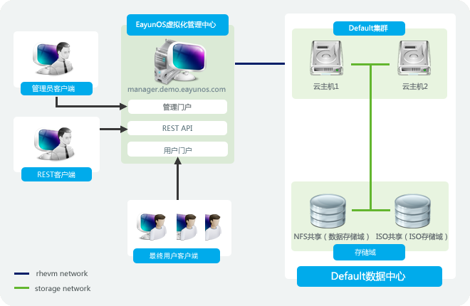

# 数据中心简介

数据中心在 OVIRT
管理系统中是很重要的一个概念。它是一个逻辑上的的概念，定义了一组在系统中的资源集合。可以把数据中心理解为各种资源的容器，其中包含了以集群和主机形式存在的*计算资源*，以逻辑网络和物理网卡形式存在的*网络资源*，以存储域形式存在的*存储资源*。

一个数据中心可以包含多个集群，每个集群同时可以包含多个主机；在每个数据中心中，可以附加多个存储域；在数据中心中的每个主机可以运行多个虚拟机。在
OVIRT 管理系统中，可以建立和管理多个数据中心，它们之间是相互独立的。

在 OVIRT
管理系统中，所有数据中心都是通过管理门户进行管理的，系统的超级管理员通过登录管理门户管理所有的数据中心。

在安装 OVIRT
系统的时候，系统会自动创建一个默认的数据中心。我们建议在使用 OVIRT
的时候，即使用不到这个默认的数据中心也不要删除它；建立一个新的命名适当的数据中心会更好。

