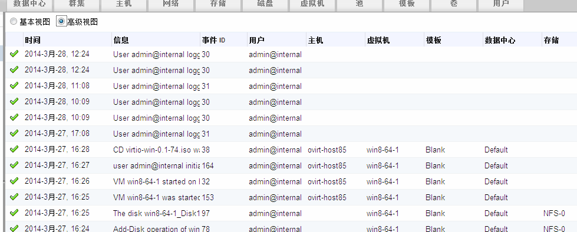

# 通过查看事件来定位问题

*事件*标签会显示一个数据中心的所有资源的相关事件信息。事件包括审计、警告和错误。显示在事件列表上的信息可以帮助管理员定位到
OVIRT 环境中发生问题的地方。

*事件*标签有两种显示的视图：基本视图和高级视图。基本视图将显示事件图标（通常是勾或者叉）、事件发生的时间和简短的事件描述。高级视图除了显示基本视图显示的信息之外，还显示事件
ID、相关用户、主机、虚拟机、模板、数据中心、存储域、集群以及关联 ID
等信息，如图：

