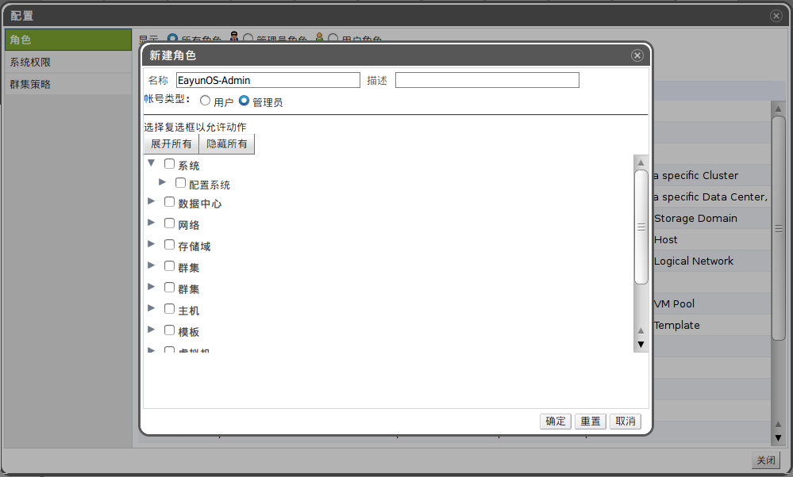

# 创建新角色

*概述*.
如果您需要的角色不在 OVIRT
的默认角色列表中，您可以创建一个新角色并且以您的需求定制它。

点击位于窗口右上方的*配置*按钮打开*配置*窗口。该窗口将显示默认的用户和管理员角色以及其它自定义角色的列表。

点击*新建*打开*新建角色*对话框。

输入新角色的*名称*和*描述*。

选择*帐号类型*为*管理员*或者*用户*。

使用*展开所有*和*隐藏所有*按钮在*选择复选框以允许动作*列表中查看关于列出的对象的详细的或者简洁的权限。您还可以对特定的对象展开或者隐藏选项。

在列出的对象中，为您正在设置的角色勾选复选框以允许，取消复选框以禁止该角色进行相应的操作。

点击*确定*应用您所做的修改。该新建的角色将会出现在角色列表中。

*结果*.
您成功创建了具有对于特定资源的权限的新角色。您可以将该新角色分配给用户。
