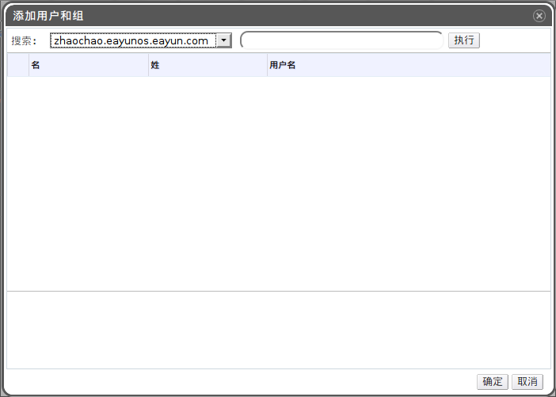

# 添加用户

*前提需求：*

-   ?

*概述*.
OVIRT
中的用户必须先从外部的目录服务中被添加进来才能够对其分配角色和权限。

点击*用户*标签显示已被授权的用户。

点击*添加*按钮打开*添加用户和组*窗口。

在*搜索*下拉菜单中选择相应的域。在搜索文本框内输入用户名称或者用户名称的一部分，点击*执行*。另外，您可以直接点击*执行*查看所有用户及组的列表。

勾选相应的用户或组之前的选择框。

点击*确定*。

*结果*.
新添加的用户显示在*用户*标签下。
