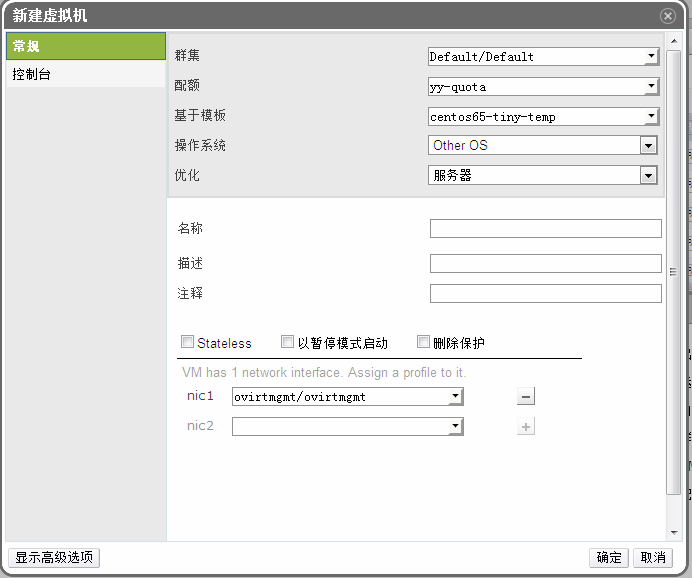

# 基于现成的模板创建虚拟机

*摘要*.
一旦模板已经配置好磁盘，网络等参数，用户可以使用模板快速的创建虚拟机。

从模板创建出来的虚拟机取决于模板的配置。如果在系统中仍然有基于某个
模板创建的虚拟机，那么该模板是不能被删除的。因为这些虚拟机和模板
有关联关系。但是如果选择从模板克隆虚拟机，那么虚拟机和模板之间的
就没有这些关联关系。

点击虚拟机标签列出系统中的所有虚拟机。

点击新建虚拟机按钮，打开新建虚拟机窗口。

选择集群，在基于模板下拉菜单中 选择需要的模板。

输入名称，描述，和注释。 其它保留默认(或者根据需要可以修改)

点击确定创建虚拟机。

*结果*.
虚拟机已经创建好了，在虚拟机列表下会显示出来，用户可以开始使用这个虚拟机了。
