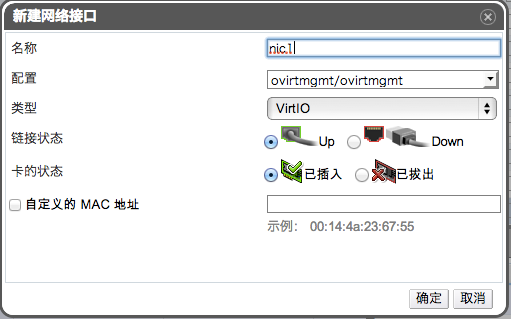
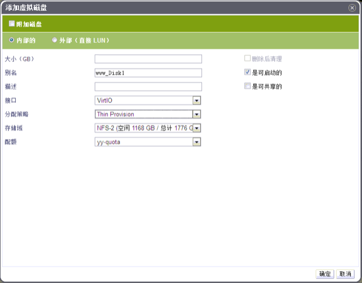

# 定义虚拟网卡及建立磁盘，完成虚拟机设置

*摘要*.
虚拟机至少需要一个虚拟磁盘和虚拟网卡，可以使用创建虚拟机时候弹出的
新建虚拟机 - 引导操作窗口来完成这些操作。

在 新建虚拟机 - 引导操作窗口，点击网络接口,
打开新建网络接口窗口，使用默认设置即可工作。

选择配置和类型，设置网络接口的 详细参数。默认状态下链路状态是Up。

如果想要设置 MAC 地址的话，在自定义的 MAC 地址 处设置给虚拟机的 MAC
地址。

该窗口还允许设置设置卡的状态: 已插入 还是已拔出。

点击确定创建网路接口，打开新建虚拟机 - 引导操作窗口。

点击配置虚拟磁盘按钮，打开添加虚拟磁盘窗口。

添加一个内部的或者外部(直接 LUN)磁盘。

点击确定创建创建虚拟磁盘。至此，虚拟机已经完成基本的 设备的配置了。

点击以后再配置，完成虚拟机的配置。

*结果*.
通过上面的步骤，已经向虚拟机添加了一个虚拟网卡和虚拟磁盘了。
