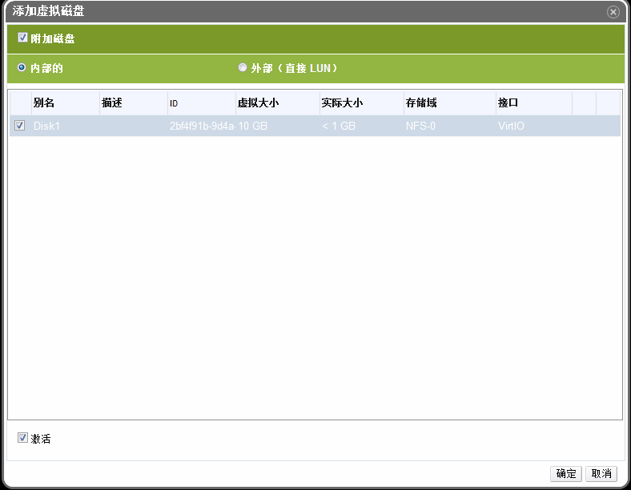

# 添加、编辑虚拟磁盘

*摘要*.
OVIRT 管理系统允许用户给虚拟机添加新的磁盘。用户可以给虚拟机添加新的
磁盘，或者把之前创建的浮动磁盘分配给虚拟机。用户也可以创建虚拟机之间可以
共享的磁盘。或者编辑磁盘的属性。
默认情况下，创建的磁盘类型是内部磁盘。用户也可以直接增加外部的磁盘。
内部磁盘被 OVIRT 管理系统管理。用户要使用外部磁盘，必须先把该磁盘(LUN)
的 target 增加到系统里。创建的磁盘可以是共享的，或者是浮动的。

点击虚拟机标签列出系统中的所有虚拟机，找到需要连接 的虚拟机。

在详细信息面板上，点击磁盘，将会显示附加到该虚拟机 上的所有磁盘。

点击添加，打开添加磁盘窗口。

在内部的和外部(直接 LUN)之间来 选择要添加的磁盘类型。

点击附加磁盘，选择要添加的磁盘。或者直接创建 一个新的磁盘附加给虚拟机。

点击窗口又下角的确定给虚拟机分配浮动磁盘。

*结果*.
我们已经给虚拟机分配给了新的磁盘，在虚拟机的磁盘列表上会被列出来。
