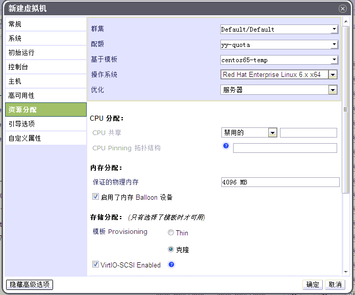

# 通过现成的模板复制虚拟机

*摘要*.
从模板克隆一个虚拟机和从模板创建一个虚拟机类似。克隆出来的虚拟机拥有
原先模板的一切内容，包括同样的硬件配置，同样的操作系统和应用软件等。
但是当虚拟机被克隆之后，它就不依赖于该模板了。

点击虚拟机标签列出系统中的所有虚拟机。

点击新建虚拟机按钮，打开新建虚拟机窗口。

选择集群，在基于模板下拉菜单中 选择需要的模板。

输入名称，描述，和注释。 其它保留默认(或者根据需要可以修改)

点击资源分配标签，在存储分配:模板 provisioning 处，选择Thin或者克隆。

用户可以基于自己的需求选择不同的分配模式，两种分配模式分别在磁盘
的读写速度和占用空间上有所不同。

-   Thin Provision: 这种模式创建磁盘的速度很快,
    对存储的占用得很少。它只在需要时候分配磁盘空间，是一种按需分配的
    方式，但是磁盘的读写速度比 Preallocated 慢，这是默认的选项。

-   Preallocated: 这种模式创建磁盘的速度很慢,
    对存储的占用得很多。在创建的时候就分配了所需的所有磁盘空间，优点是
    磁盘的读写速度比 Thin Provision 快。

点击确定创建虚拟机。

> **Note**
>
> 克隆虚拟机会花很长时间，因为它复制了整个模板的内容。在此期间，虚拟机
> 处于镜像锁定状态。 

*结果*.
虚拟机已经创建好了，在虚拟机列表下会显示出来，用户可以开始使用这个虚拟机了。
