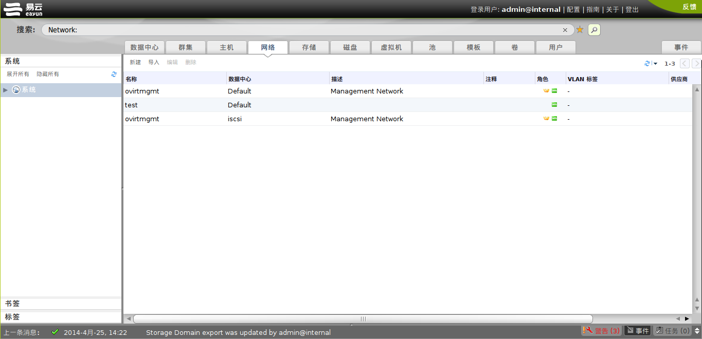

# 使用网络标签

主面板中的*网络*标签为用户进行网络相关的操作和基于网络的属性或者网络与其它资源间的关联查找相应的逻辑网络提供了一个集中的操作界面。

在 OVIRT
环境中所有的逻辑网络都将在*网络*标签下列出。*新建*、*编辑*和*删除*按钮允许您创建、修改或者删除数据中心中的逻辑网络。

点击主面板中逻辑网络的名称，然后使用详情面板中的*集群*、*主机*、*虚拟机*、*模板*以及*权限*子标签能够完成如下功能：

-   将逻辑网络分配到集群或者主机中

-   从集群或者主机中分离逻辑网络

-   删除虚拟机和模板中的虚拟网卡

-   为用户增加或者删除权限，使得用户可以接入逻辑网络或者对逻辑网络进行管理

以上的功能，也能够在主面板相应的资源标签中完成。关于如何在相应的资源中设置网络，请参见以下链接。
*参见：*

-   ?
