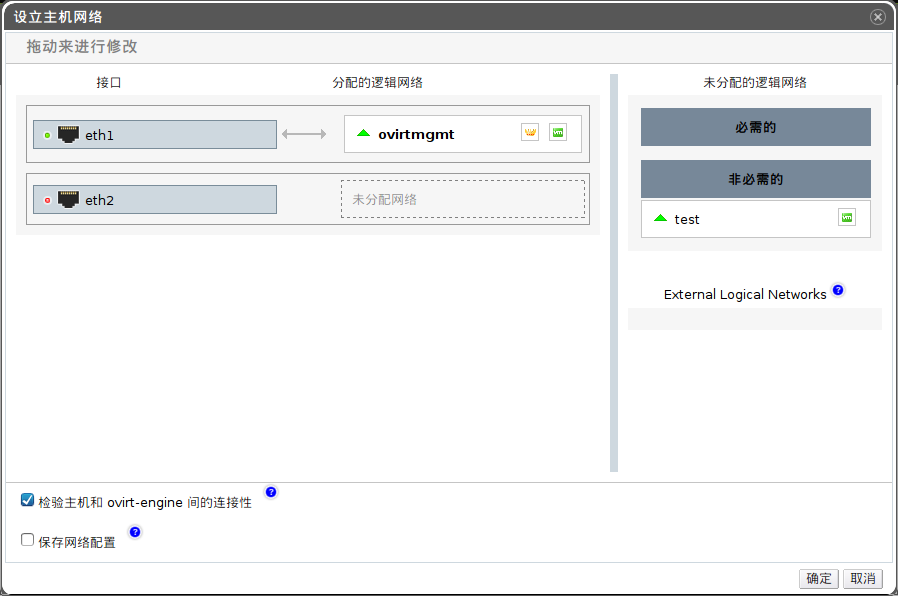

# 使用逻辑网络为单独一块物理网卡添加多个 VLAN

*前提：*

-   ?

*概述*.
可以为单独一块物理网卡添加多个 VLAN 从而分离主机上的网络流量。

> **Important**
>
> 您必须拥有多个在*新建逻辑网络*或者*编辑逻辑网络*窗口中选择了*启用 VLAN
> 标签*的逻辑网络。

使用*主机*标签、树形面板或者搜索功能在主面板中查找并选择位于您已经分配了启用了
VLAN 标签的逻辑网络的集群中的主机。

在详情面板中点击*网络接口*标签，列出该主机上的物理网卡。

点击*设立主机网络*按钮打开*设立主机网络*窗口。

将启用了 VLAN
标签的逻辑网络拖动到窗口左部*接口*右边旁边的*分配的逻辑网络*区域。由于启用了
VLAN 标签，物理网卡能同时连接至多个逻辑网络。

将您的鼠标置于该逻辑网络之上，点击铅笔小图标打开*编辑网络*窗口来编辑该逻辑网络的设置。

如果您在MANAGER上该逻辑网络的设置与主机上的网络配置并未同步，请勾选上*同步网络*选择框。

从以下内容中选择*引导协议*：

-   *None*，

-   *DHCP*，或者

-   *Static*，并提供 *IP* 和*子网掩码*。

点击*确定*按钮。

勾选*检查主机和MANAGER间的连接性*来检查网络，该选项仅在主机为维护状态时有效。

勾选*保存网络配置*选项。

点击*确定*按钮。

通过编辑该集群中所有主机的网络接口设置来添加该逻辑网络到每台主机上。完成后，该逻辑网络开始正常工作。

*结果*.
您成功地将多个启用了 VLAN
标签的逻辑网络添加到了单独一块物理网卡上。可以多次重复该操作，选择并编辑同一块物理网卡，从而添加启用不同
VLAN 标签的多个逻辑网络到该网卡上。
