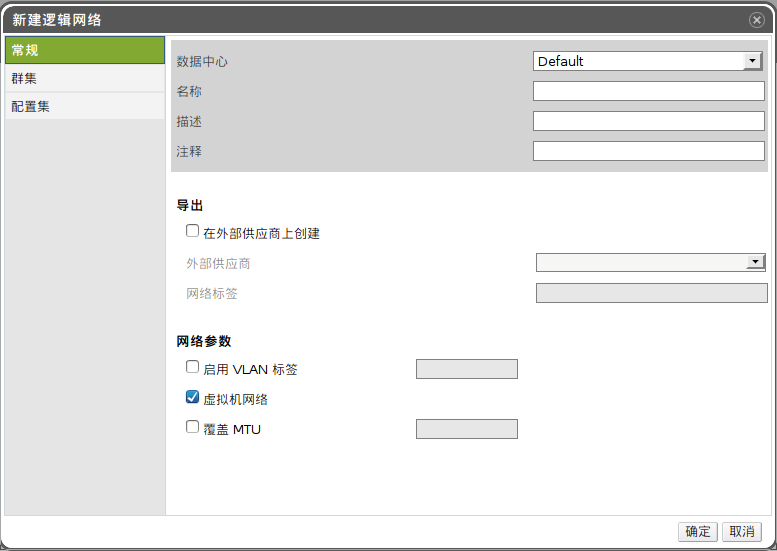

# 在数据中心或者集群中创建逻辑网络

*概述*.
在数据中心或者集群中创建逻辑网络并设置它的用途。

使用*数据中心*或者*集群*标签、树形面板或者搜索功能在主面板中显示并选择相应的资源。

在详情面板中选择*逻辑网络*子标签以列出已经存在的逻辑网络。

如果是在*数据中心*的详情面板中，需要点击*新建*按钮打开*新建逻辑网络*窗口。如果是在*集群*的详情面板中，则是点击*添加网络*按钮打开*新建逻辑网络*窗口。

输入该逻辑网络的*名称*、*描述*和*注释*。

在*导出*部分，选中*在外部供应商上创建*以在外部逻辑网络提供者上创建该逻辑网络。在*外部供应商*下拉列表中选择一个外部的逻辑网络提供者，并且输入该逻辑网络的*网络标签*。

选中*启用 VLAN 标签*、*虚拟机网络*和*覆盖 MTU* 选择框来打开这些选项。

在*集群*标签中，选择要将该逻辑网络附加到的集群。您还可以指定该逻辑网络是否为一个必需的网络。

在*配置集*标签中，按照需要添加虚拟网卡配置集到该逻辑网络。

点击*确定*。

*结果*.
您成功地创建了该逻辑网络作为数据中心下属的集群中所需要的资源。现在您可以将该资源添加到集群中的主机。

*参见：*

-   ?

-   ?
