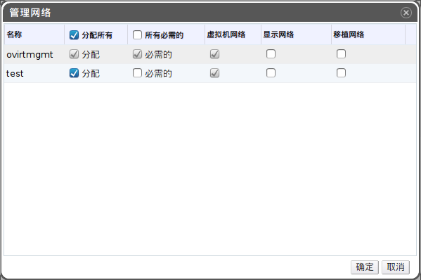

# 在管理网络窗口中为逻辑网络指定一个特定的类型

*前提：*

-   ?

*概述*.
为逻辑网络指定一个特定的流量类型以优化网络流量情况。

使用*集群*标签、树形面板或者搜索功能在主面板中查找并选择集群。

在详情面板中选择*逻辑网络*标签，列出分配到该集群中的逻辑网络。

点击*管理网络*按钮打开*管理网络*窗口。

在该窗口中，勾选上相应的选择框进行配置。

点击*确定*保存修改并关闭该窗口。

*结果*.
通过将特定类型的网络流量指定由特定的逻辑网络负责承载，您成功优化了网络的流量情况。

> **Note**
>
> 外部供应商提供的网络无法被用作显示网络。

*参见：*

-   ?
