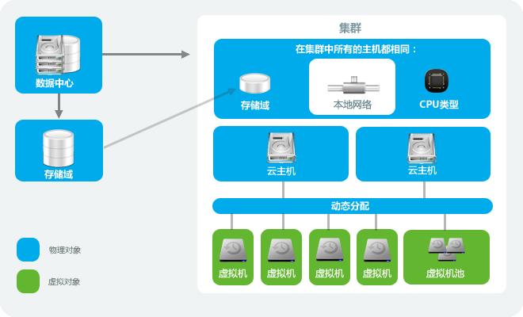

# OVIRT集群介绍

集群是一组主机的集合，在同一集群下的主机可共享相同的存储域，且CPU的
型号须同质（Intel或AMD）。如果主机之间有不同代的CPU，那么
只能使用所有主机共有的 CPU 指令集。

每个集群必然属于一个数据中心，每个主机也必然属于一个集群，虚拟机会
动态的被分配到集群内的主机中，且可以在主机间动态迁移，是否迁移虚拟机依
据集群所定义的一些规则（可在*集群*面板中配
置,集群是定义负载均衡和省电模式规则的最高级别）。

OVIRT集群分为两种，一种是运行虚拟机的，另外一种是运行OVIRT\_STORAGE
服务的, 一个集群不能同时运行虚拟机服务, 又运行 OVIRT\_STORAGE 服务.

OVIRT默认安装的时候会自动配置一个默认的数据中心和默认的集群。

*请参考:*

-   ?

-   ?

-   ?

-   ?

