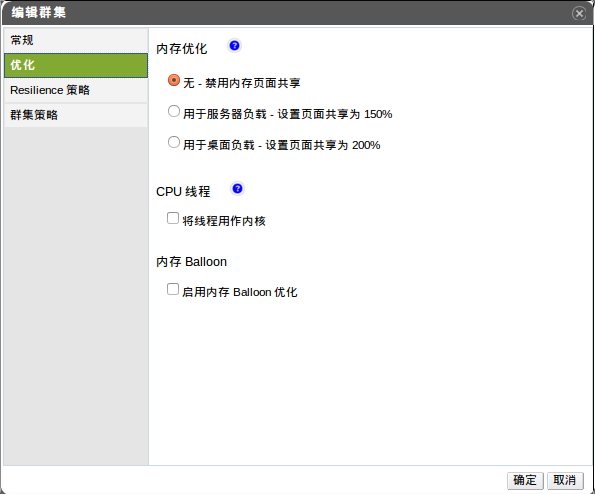

# 优化选项解释

内存页共享，就是在某些虚拟机没有占用给它分配的内存时，可以给需要
更多内存的虚拟机，这个值最大可达到200%，当然这有个假设的前提条件
，那就是在OVIRT虚拟化环境中，不是所有的虚拟机都达到饱和状态。

CPU线程，也就是可以运行虚拟机的总的CPU core数量大于主机所拥有的
core数量，这主要用于CPU负载不高的情形，在某种程度上可以降低对硬件
的要求。当然也需要考虑到虚拟机所运行的主机CPU的拓朴结构，以免出现
不能正常运行的情况，尤其是虚拟机的CPU core数量在主机的CPU core数量
和主机CPU的超线程数量之间。

下面的表格是在*新建集群*或*编辑集群*窗口中*优化*tab下设置详细描述：

|填充项|描述/操作|
|------|---------|
|内存优化|-   *无 - 禁用内存页面共享*:即不使用 内存共享。  -   *用于服务器负载 - 设置页面共享为 150%*     在集群的每台主机设置内存可共享上限为150%.  -   *用于桌面负载 - 设置页面共享为 200%*     在集群的每台主机设置内存可共享上限为200%.  |
|CPU线程|选择*将线程用作内核*多选框，则表示可以 让虚拟机拥有的总的CPU core数量大于主机所拥有的数量。  主机的超线程可以被虚拟机当作core来使用，例如，一台主机拥有 12个core的超线程x2的CPU，则共24个超线程，那么虚拟机就可拥有 24个core，但是带来的后果就是，CPU负载的计算算法将是平时的2 倍。|
|内存Balloon|选择*启用内存 Balloon 优化*多选框，则表示 在此集群中所有的主机激活内存超分配，一旦此选项生效，则内存超 分配管理程序（MoM）就会启动Bollooning，Bollooning本身会有为每 个虚拟机赋予一预先设定的值。  Bollooning运行的前提是，运行在虚拟机客户操作系统里的驱动必须是 工作的，在OVIRT中，除非用户手动删除，默认创建的虚拟机都会有 Bollooning的设备。  当设置完成后，当集群内的主机状态变为*up*时， 都会更新Bolloon的策略。  另外需要特别强调的一点是，在某些场景下bollooning和KSM会有冲突。 大多数情况下，MoM会尝试调整bolloon大小将冲突降至最小，但还是有 bollooning会引起虚拟机性能的次优，这里建立管理员慎用bollooning 优化。|
