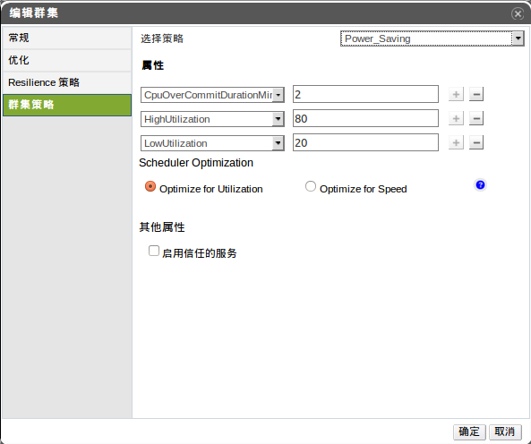

# 在集群中为主机设置负载策略

集群的规则就是让用户指定CPU的上、下限制值，且当负载真的达到或超出
或低于上、下限制值的时候所采取的措施。定义了集群规则就意味着此集群
内拥有了在主机间的自动负载均衡功能。

当主机的CPU负载超过*High Utilization*值时，会迁移
虚拟机到其他主机上，以达到降低此主机的高负载。

当主机的CPU负载低于*Low Utilization*值时，会将此
主机中运行的所有虚拟机迁移到其他主机中，迁移完成后，就可以关闭此主机
的电源，直到再次需要它才重新启动。

使用资源列表或树形结构或搜索功能，找到集群项，选择任意集群。

点击*编辑*，打开*编辑集群* 窗口。

选择如下三种规则中的一种：

-   无

-   *Evenly\_Distributed*-在*HighUtilization*
    项后面的输入框内输入CPU利用率的百分比。

-   *Power Saving* -
    此项下需要输入两个值，一个是*LowUtilization*,即低于这个CPU利用率的百分比，以及和*Evenly\_Distributed*一样的最高的CPU利用率百分比阀值。

*CpuOverCommitDurationMinutes*输入框，可最多定义一个2位数字，
代表的以分钟为单位的时间，当负载超出或低于预设值时，并超出这个时间，则表示触发
集群策略。

如果用户使用OpenAttestation服务以验证主机，则使用*engine-config*
工具设置细节，并激活*信任服务*

点击*确定*。

结果：

为集群成功的更新了策略。

*请参考*.
?
