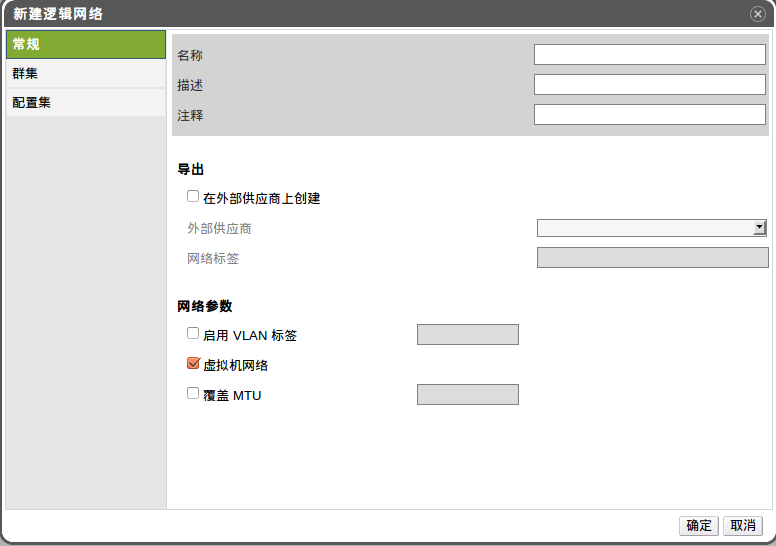

# 建立逻辑网络（数据中心或集群）

*摘要*.
以下步骤为在数据中心或者集群中创建和定义逻辑网络。

使用*数据中心*或*集群*资源列表 或树形结构或搜索功能，选中结果列表。

点击*逻辑网络*,会自动列出现存在的逻辑网络。

在*数据中心*的详细列表中，点击*新建* 打开*新建逻辑网络*窗口；在*集群*
的详细列表中，点击*添加网络*打开*新建逻辑网络*。

为逻辑网络输入*名称*,*描述*, *注释*。

在*导出*项中，选择*在外部供应商上创建*,在*外部供应商*的下拉列表框中选择已
经建立好的外部供应商，并输入*网络标签*。

选择*启用 VLAN 标签*,*虚拟机网络* ,*覆盖 MTU*,以激活对应的属性。

在*集群*标签下，选择欲将网络分配给某个集群，用户
也可指定此逻辑网络是必需的。

在*配置集*标签下，为逻辑网络分配*vNIC profiles*。

点击*确定*。

*结果*.
用户已经定义所谓前提项的逻辑网络资源，此时可以给此集群中的主机添加此资源。

> **Note**
>
> 当新建一逻辑网络或者是修改现有的逻辑网络用于显示网络时，原来使用此网络的
> 虚拟机必须重启后，此网络才可用。
