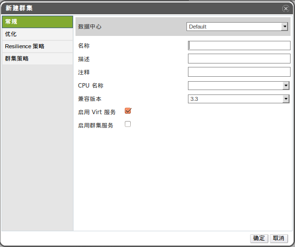

# 集群常规配置的解释

当输入非正确的字段，会在用户点击*确定*按钮时出错, 出错
的部分会显示为菊黄色的，且无法进行下一步的操作，通常情况下会提示预期
值或值范围不对。

下面的表格是在*新建集群*或*编辑集群*窗口中*通用*tab下设置详细描述：

|填充项|描述/操作|
|------|---------|
|数据中心|集群将加入的数据中心。|
|名称|集群的名称，可包含40个字符，尽量保证是独一无 二的，可以是任意的大、小写字母，数字，短横线， 下划线。|
|描述|集群的详细描述，OVIRT建议填写但不是强制性的。|
|CPU名称|集群的CPU类型，可从下列中选出： -   Intel Conroe Family  -   Intel Penryn Family  -   Intel Nehalem Family  -   Intel Westmere Family  -   Intel SandyBridge Family  -   Intel Haswell  -   AMD Opteron G1  -   AMD Opteron G2  -   AMD Opteron G3  -   AMD Opteron G4  -   AMD Opteron G5  集群内所有主机必须运行在同一型号的CPU（Intel或AMD）。 且一旦集群建立后不允许变动。CPU的类型选择尽可 能的选择低代的，比如，一个拥有*Intel Haswell*的主机是可以加入到类型为*Intel Westmere Family*的集群中的，相反，*Intel Nehalem Family*就不可以，且只能发挥低代 的CPU的特性。|
|兼容版本|OVIRT的版本号，你可以从以下选择： -   3.0  -   3.1  -   3.2  -   3.3  用户不可以将集群的版本设置低于所在数据中心的版本。|
|启用Virt服务|如果这个单选框选中，运行在此集群下的主机被用于运行 虚拟机。|
|启用Gluster服务|如果选中此单选框，运行在此集群下的主机将用于OVIRT\_STORAGE 的节点，而不是运行虚拟机。且用户不能将OVIRT Hypervisor Node加入到此集群中。|
|导入现有的gluster集群配置|此可选项仅用于当*启用Gluster服务* 被选中时，此属性可以让用户导入一个已有的gluster集群， 且其所包含的所有主机。  下列属性是要导入主机时填写的内容：  -   *地址*:输入Gluster主机的IP 地址或FQDN的名称。  -   *SSH指印*:OVIRT会尝试取得主机的     指印，以确保用户连接的是真需要连接的主机  -   *密码*:输入主机的root用户密码。  |

*请参考*.
?
